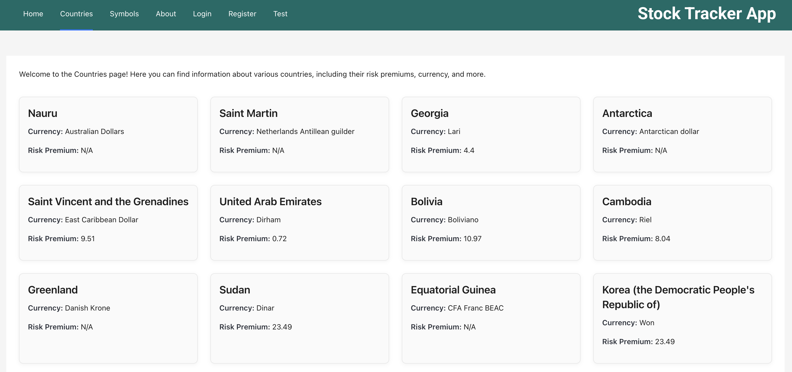
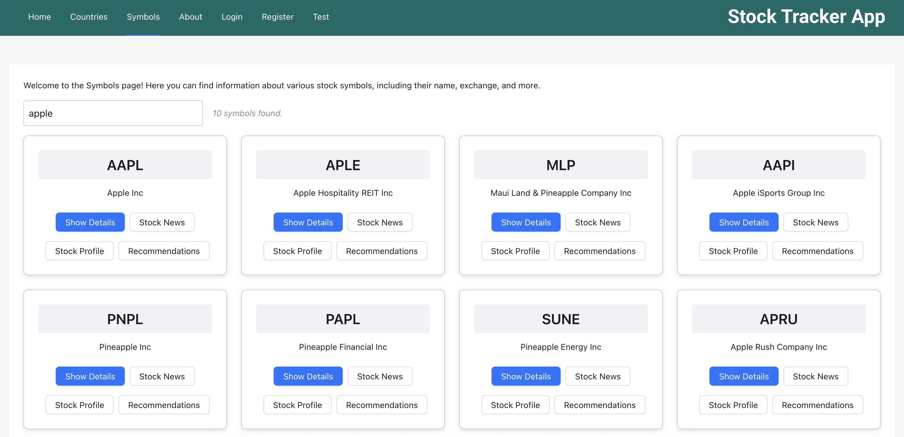
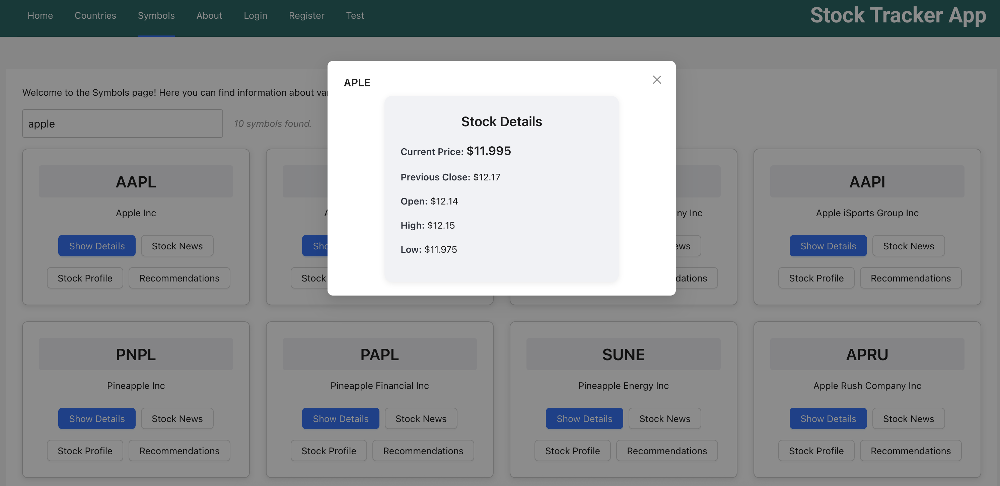

# React Stock Tracker

Welcome to the **React Stock Tracker** project! This application is built using modern web technologies like React, TypeScript, and Ant Design to provide an interactive and visually appealing experience for traders.

This app uses the API https://finnhub.io to display stock related info.

I wanted to experiment with this new library called Jotai for state management. I had a really good experience working with this library.

## Technologies Used

## Screenshots

Please find some of the screenshots of this app. It includes symbols and countries page.

## Features

- **React**: A powerful library for building dynamic user interfaces.
- **TypeScript**: Ensures type safety and better developer experience.
- **Ant Design**: A comprehensive UI framework for creating elegant and responsive designs.
- **Vite**: A fast build tool and development server for efficient development.
- **HMR**: Hot Module Replacement for a smooth development workflow.
- **ESLint**: Enforces code quality and consistency.

## About the App

This project also features a **Stock Tracker** app, allowing users to view real-time stock prices, company information, and other relevant financial data. The app provides an intuitive interface for searching stocks, viewing detailed company profiles, and tracking price changes. It is designed to help users stay informed about market trends and make better investment decisions.

This app allows you to explore stocks listed in NYSE (New York Stock Exchange). You can see details of the stock, news related to stock and also stock recommendations coming from Finnhub API.
